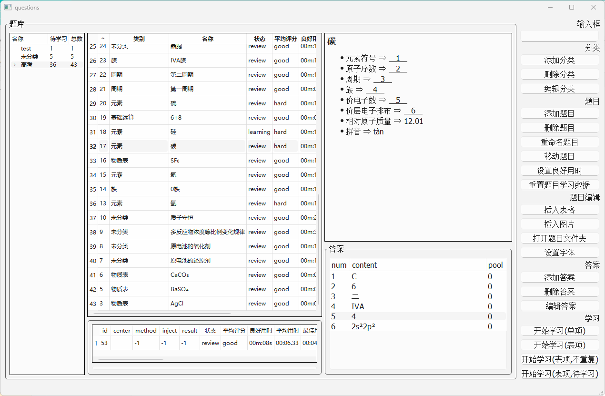
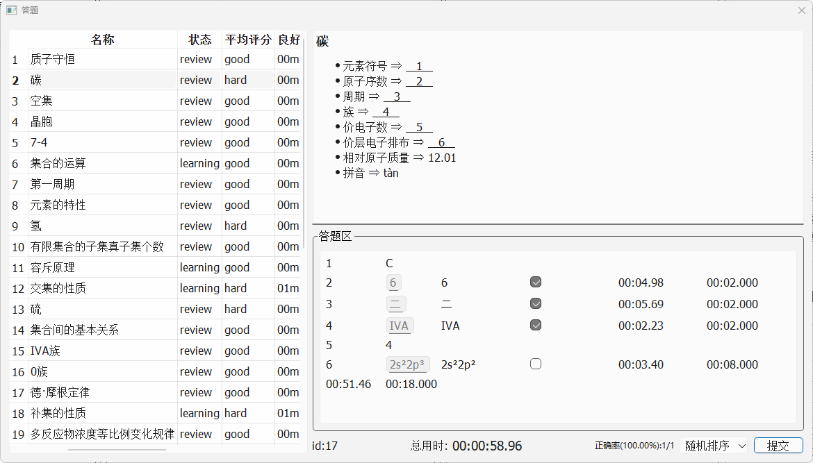

# questions
- 描述 ⇒ 题库型的学习软件，采用FSRS算法，核心思路与anki相同。以填空题答题时间为依据判断对知识点的掌握程度。

- 快捷键说明
  1. F1 ⇒ 添加答案（会以选中文本为初始值）
  2. F2 ⇒ 添加答案后转填空下划线 （会以选中文本为初始值，若没有选中文本则会直接添加填空下划线）
  3. F3 ⇒ 添加描述条目
     - 功能说明 ⇒ 通过结构化的方式记录、整理知识点，具体设计和用法可以参考[draft.md](https://github.com/DKLost/questions/blob/main/draft.md)（草稿和具体实现有出入），目前还没有通过程序实现草稿中的逻辑设计，只作为手动编排的辅助功能。
  4. F4 ⇒ 添加typst公式（会以选中文本为初始值）
  5. F5 ⇒ 根据当前填空编号，自动编号下一填空
  6. F6 ⇒ 切换选定部分下划线

- 示例：
  1. 
  2. 

- 注：
  1. 本项目FSRS算法实现主要来自该项目：https://github.com/open-spaced-repetition/fsrs4anki
  2. 感谢FSRS算法的创造者、实现者们。
